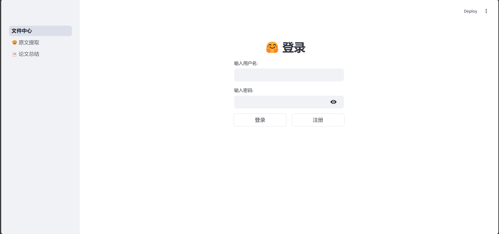
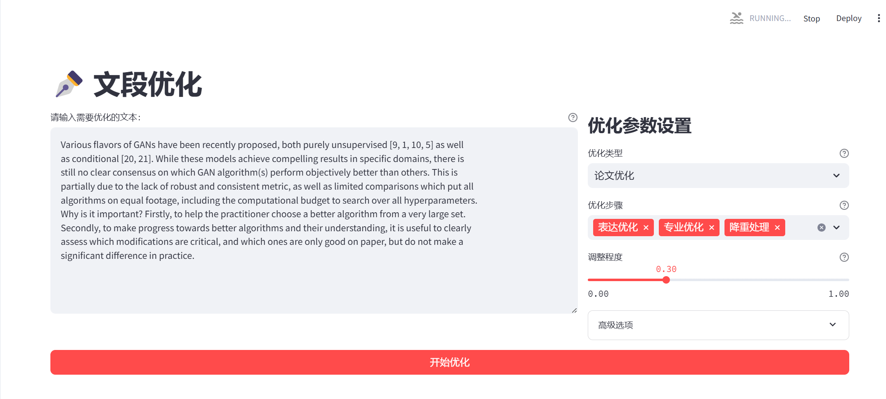
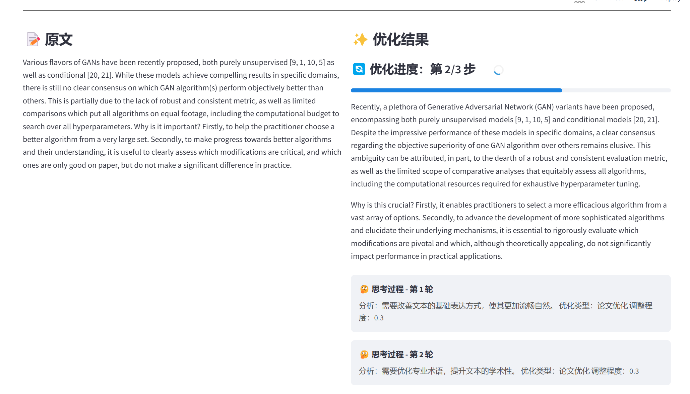
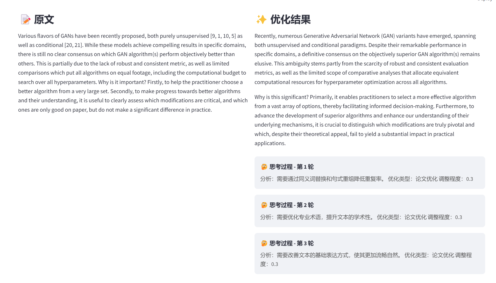
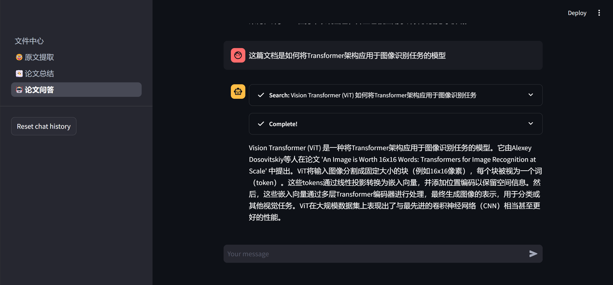
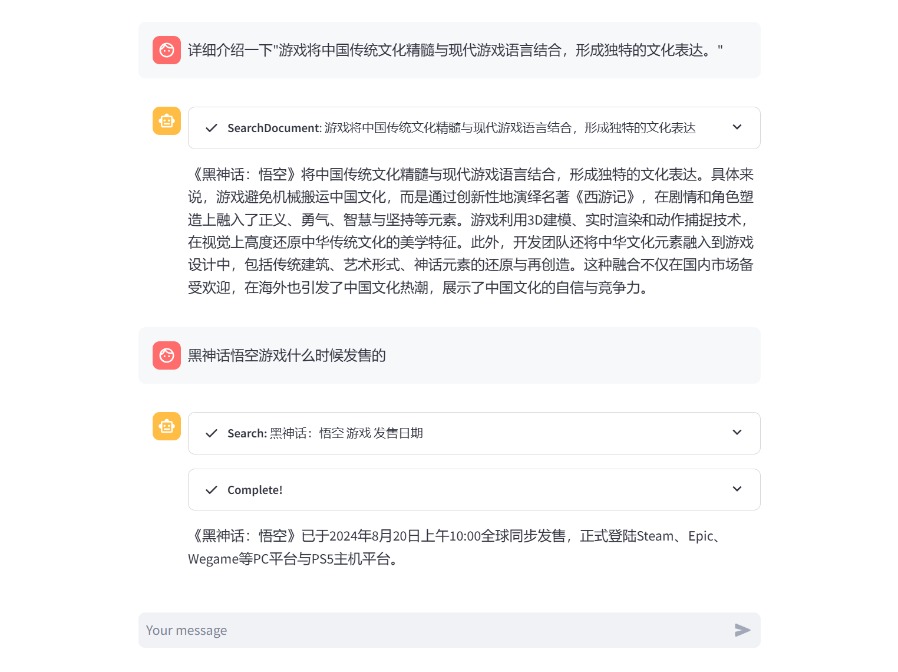
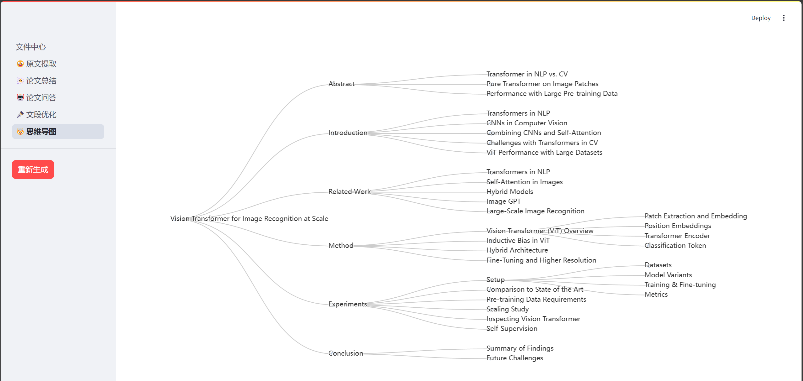

# 文献阅读助手
[English](README_EN.md) | 简体中文

一个基于人工智能的文献阅读辅助工具，帮助研究人员和学生更高效地阅读、理解和分析学术文献。

## ✨ 主要特性

- 🔐 完整的用户系统（登录/注册）
- 📁 文件管理中心
- 📑 智能文献分析
  - 自动提取关键原文和标注
  - 生成文献总结
  - 智能降重和文段优化
  - 交互式论文问答
- 🗺️ 可视化思维导图
  - 基于 st_pyecharts 和 pyecharts.charts.Tree 实现
  - 直观展示文献结构和关键概念

## 🚀 快速开始

### 环境要求
- Python 3.8+
- pip < 24.1 (`python -m pip install pip==24.0`)

### 安装步骤

1. **克隆仓库**      
```bash
git clone <仓库地址>
cd <项目目录>   
```

2. **创建虚拟环境**      
```bash
python -m venv venv
# Linux/MacOS
source venv/bin/activate
# Windows
venv\Scripts\activate   
```

3. **安装依赖**      
```bash
pip install -r requirements.txt   
```
4. **设置环境变量**      
记得设置环境变量 `DASHSCOPE_API_KEY`，可以参考 [首次调用通义千问API](https://help.aliyun.com/zh/model-studio/getting-started/first-api-call-to-qwen) 的文档
5. **运行项目**      
```bash
streamlit run 文件中心.py   
```

6. **访问应用**
打开浏览器访问 `http://localhost:8501`

## 📸 功能展示

### 登录界面


### 文件中心


### 原文提取


### 文段优化




### 论文问答



### 思维导图


## 🛠️ 技术栈

- 前端：Streamlit
- 后端：Python
- 可视化：pyecharts

## 🗺️ 开发路线图

- [x] 用户系统
- [x] 文件中心
- [x] 文献分析核心功能
- [x] 思维导图可视化
- [x] 集成 LangChain 框架
- [ ] 重构：将 utils 迁移到独立文件夹
- [ ] ~~一键翻译论文~~ (已搁置)

## 📝 注意事项

- pip 版本需要小于 24.1，可以使用以下命令安装指定版本：  ```bash
  python -m pip install pip==24.0  ```

## 🤝 贡献指南

欢迎提交 Issue 和 Pull Request 来帮助改进项目！


